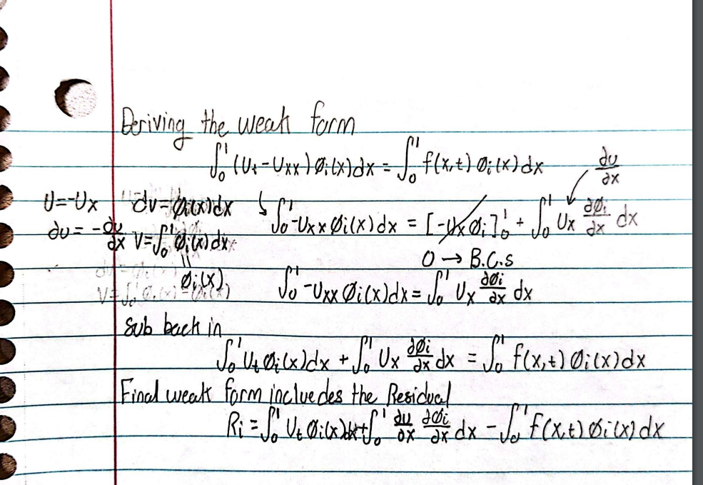

# 1D Galerkin Solver

## Description
This project is a 1D Finite Element Method (FEA) solver using Galerkin's method with 1D Lagrange basis functions and 2nd order Gaussian Quadrature for numerical integration, also implementing both Forward and Backward Euler approximations.

## Heat Transfer Problem
Consider the heat transfer problem defined by the equation:

$$
u_t - u_{xx} = f(x, t), \quad (x, t) \in (0,1) \times (0,1)
$$

with initial and Dirichlet boundary conditions:

$$
u(x, 0) = \sin(\pi x)
$$

$$
u(0, t) = u(1, t) = 0
$$

and the function $f(x,t)$ defined as:

$$
f(x, t) = (\pi^2 - 1)e^{-t} \sin(\pi x)
$$

The analytic solution to this problem is:

$$
u(x, t) = e^{-t} \sin(\pi x)
$$

This problem is solved using the Galerkin method within the context of the 1D FEA solver to approximate the temperature distribution over time in a 1D domain.

## Weak Form Derivation
We are asked to derive the weak form of the equation by hand. The weak form of the equation is derived as follows:

